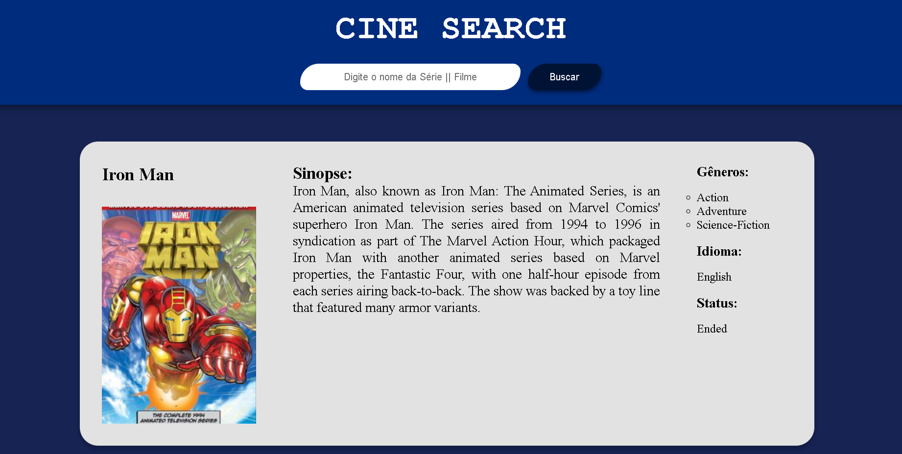
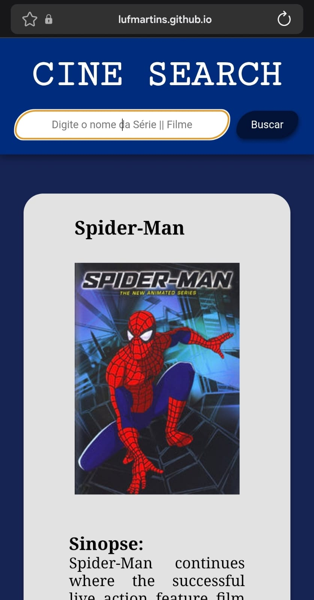

# 🎬 CineSearch - Buscador de Séries & Filmes

Uma aplicação web moderna desenvolvida em React e TypeScript para consultar séries e programas de TV em tempo real, utilizando a API pública do TVMaze.

--- 
<!-- Contêiner HTML para centralizar as imagens -->
<div align="center">
  
  
</div>
---

## 📌 Sobre o Projeto

O **CineSearch** é um desafio prático focado no consumo de APIs RESTful que retornam estruturas de dados aninhadas e campos nulos, colocando em prática conceitos fundamentais de TypeScript, sanitização de dados e gerenciamento completo de estados de interface.

### ✨ Funcionalidades
- 🔍 **Busca em tempo real:** Consulta de séries e programas pelo nome.
- 📺 **Exibição Detalhada:**
  - Pôster/capa oficial do programa (com imagem de *fallback* para mídias sem capa).
  - Título, nota média (*rating*), idioma, status e gêneros.
  - Sinopse limpa e formatada (remoção de tags HTML da API).
- ⚡ **Experiência do Usuário (UX):**
  - Atalho de busca acionado pela tecla `Enter`.
  - Indicador visual durante o carregamento (*loading*).
  - Tratamento e exibição de mensagens para buscas sem resultado ou falhas de rede.
  - Layout responsivo em Grid com rolagem vertical controlada.

---

## 🛠️ Tecnologias Utilizadas

- **[React](https://react.dev/)** — Biblioteca para construção de interfaces.
- **[TypeScript](https://www.typescriptlang.org/)** — Tipagem estática para manipulação segura dos dados da API.
- **[Vite](https://vitejs.dev/)** — Ferramenta de build rápida para o desenvolvimento frontend.
- **Fetch API** — Consumo assíncrono de dados HTTP.
- **CSS3** — Grid, Flexbox e estilização de barra de rolagem customizada.

---

## 📚 Conceitos Aplicados

Neste projeto foram aplicados os seguintes tópicos de desenvolvimento frontend:

1. **Tipagem de Dados Aninhados:** Criação de `interfaces` em TypeScript capazes de lidar com objetos aninhados e propriedades nulas (`string | null`, `number | null`).
2. **Sanitização de Dados:** Uso de Expressões Regulares (Regex) para remover tags HTML brutas contidas nos campos de sinopse.
3. **Mapeamento e Renderização de Listas:** Uso do operador `.map()` para listar múltiplos cards de forma performática.
4. **Gerenciamento de Estados Globais e Locais (`useState`):** Controle fino dos estados de busca, resultado, erro e carregamento.
5. **Tratamento de Erros Robusto:** Estrutura `try/catch/finally` aliada à validação de instâncias de erro com `error instanceof Error`.
6. **CSS Grid & Layouts Roláveis:** Controle de estouro de tela com `max-height` e `overflow-y: auto`.

---

## 🚀 Como Executar o Projeto

### Pré-requisitos
Você precisará ter o [Node.js](https://nodejs.org/) e o [Git](https://git-scm.com/) instalados em sua máquina.

### Passo a passo

```bash
# 1. Clone este repositório
$ git clone [https://github.com/SEU_USUARIO/cinesearch-react.git](https://github.com/SEU_USUARIO/cinesearch-react.git)

# 2. Acesse a pasta do projeto
$ cd cinesearch-react

# 3. Instale as dependências
$ npm install

# 4. Inicie o servidor de desenvolvimento
$ npm run dev